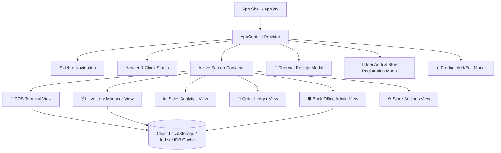
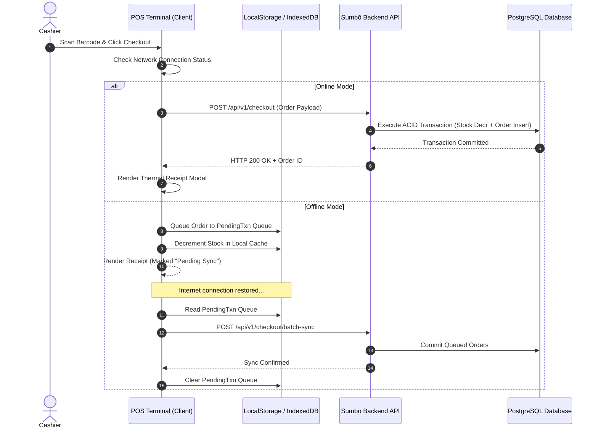

# 02. Frontend Architecture & State Management

> **Layer**: Client Application Architecture  
> **Framework**: React 18 + Vite + Lucide UI  
> **Target Execution**: Desktop Web, Tablet PWA, Mobile POS

---

## 1. Frontend Architecture Overview

The Sumbō client application is structured as a single-page application (SPA) optimized for low latency, local state persistence, and instant catalog rendering.



---

## 2. Component Directory Breakdown

```
src/
├── App.jsx                       # Main layout shell & toast notification manager
├── main.jsx                      # Vite entrypoint with React.StrictMode
├── index.css                     # Global Lumina Executive Design System
├── context/
│   └── AppContext.jsx            # Central reactive state, auth & localStorage sync
├── data/
│   └── seedData.js               # Initial seed dataset & store demo profiles
└── components/
    ├── Sidebar.jsx               # Navigation bar & user store pill
    ├── Header.jsx                # Header bar, search & system status
    ├── Auth/
    │   └── AuthModal.jsx         # Sign Up, Sign In & store registration modal
    ├── POS/
    │   ├── POSTerminal.jsx       # Catalog grid, cart drawer & checkout
    │   └── ReceiptModal.jsx      # Thermal printable receipt generator
    ├── Inventory/
    │   ├── InventoryManager.jsx  # SKU ledger table & quick stock adjust
    │   └── ProductModal.jsx      # Add / edit product creation modal
    ├── Analytics/
    │   └── SalesAnalytics.jsx    # Real-time KPI cards & SVG trend charts
    ├── Transactions/
    │   └── TransactionHistory.jsx# Order ledger & receipt lookup
    ├── Admin/
    │   └── BackOfficeAdmin.jsx   # Super admin store directory & feature flag toggles
    └── Settings/
        └── StoreSettings.jsx     # Store details & tax configuration
```

---

## 3. Offline Synchronization Strategy

To ensure zero downtime during network outages, Sumbō implements an offline sync strategy:


