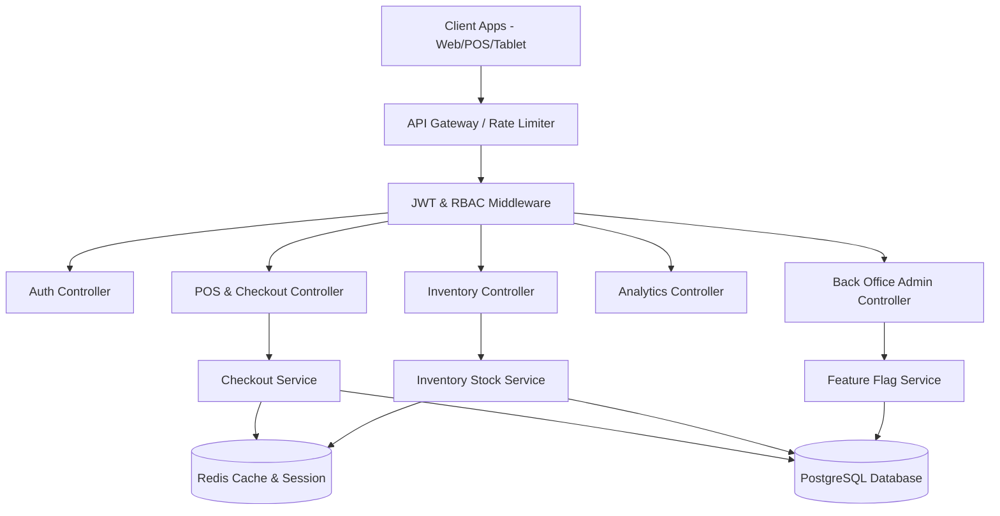

# 03. Backend Services & REST/WebSocket API Architecture

> **Layer**: Server-side Services & API Gateway  
> **Runtime**: Node.js 20 / TypeScript + Express  
> **Security Protocol**: JWT (RS256) + HttpOnly Refresh Cookies + RBAC

---

## 1. Backend Layered Architecture

The Sumbō backend service follows a clean 3-tier layered architecture (Controller -> Service -> Data Access Layer / ORM) ensuring strict separation of concerns.

---

## 2. API Endpoints Specification

### A. Authentication & User Management (`/api/v1/auth`)
| Method | Endpoint | Description | Auth Required |
| :--- | :--- | :--- | :--- |
| `POST` | `/api/v1/auth/signup` | Register new user account & store business | Public |
| `POST` | `/api/v1/auth/login` | Authenticate user & issue JWT tokens | Public |
| `POST` | `/api/v1/auth/refresh` | Refresh expired access token via HttpOnly cookie | Public |
| `POST` | `/api/v1/auth/logout` | Revoke session & clear cookies | Authenticated |
| `GET` | `/api/v1/auth/me` | Fetch active user profile and store context | Authenticated |

### B. POS Checkout & Sales (`/api/v1/pos`)
| Method | Endpoint | Description | Auth Required |
| :--- | :--- | :--- | :--- |
| `POST` | `/api/v1/pos/checkout` | Process order, compute tax/discounts, decrement stock | Store Cashier/Owner |
| `POST` | `/api/v1/pos/sync-batch` | Bulk sync offline queued checkout transactions | Store Cashier/Owner |
| `GET` | `/api/v1/pos/transactions` | Fetch order ledger history with pagination | Store Cashier/Owner |
| `GET` | `/api/v1/pos/transactions/:id` | Lookup receipt details by Order ID | Store Cashier/Owner |

### C. Inventory Management (`/api/v1/inventory`)
| Method | Endpoint | Description | Auth Required |
| :--- | :--- | :--- | :--- |
| `GET` | `/api/v1/inventory/products` | Fetch catalog list with search & category filters | Store Cashier/Owner |
| `POST` | `/api/v1/inventory/products` | Create new SKU product | Store Owner |
| `PUT` | `/api/v1/inventory/products/:id` | Update product details, price, or reorder point | Store Owner |
| `DELETE` | `/api/v1/inventory/products/:id` | Remove SKU product from catalog | Store Owner |
| `PATCH` | `/api/v1/inventory/stock-adjust` | Quick stock replenishment or manual adjustment | Store Cashier/Owner |

### D. Back Office Administration (`/api/v1/admin`)
| Method | Endpoint | Description | Auth Required |
| :--- | :--- | :--- | :--- |
| `GET` | `/api/v1/admin/stores` | Fetch directory of all registered stores | Super Admin |
| `POST` | `/api/v1/admin/stores` | Provision new store account and subscription plan | Super Admin |
| `PATCH` | `/api/v1/admin/stores/:id/status` | Suspend or activate a store account | Super Admin |
| `PATCH` | `/api/v1/admin/stores/:id/features` | Toggle platform module flags per store | Super Admin |

---

## 3. RBAC (Role-Based Access Control) Matrix

| Role | Access Level & Permissions |
| :--- | :--- |
| **Super Admin** | Full Back-Office control across all stores, plan provisioning, feature flag toggling, global metrics. |
| **Store Owner** | Full store administration, inventory CRUD, store settings, tax rates, sales analytics, employee creation. |
| **Store Cashier** | POS Checkout, barcode search, order execution, receipt lookup, quick stock replenish. |
