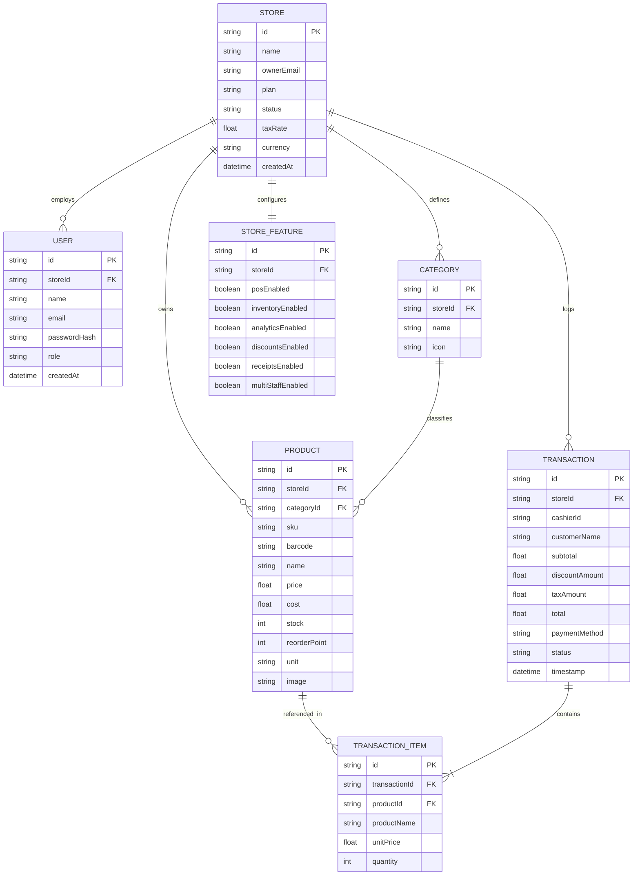

# 04. Database Schema & Data Model Specification

> **Database Engine**: PostgreSQL 16  
> **ORM Engine**: Prisma ORM  
> **Integrity Mode**: Relational ACID & Multi-Tenant Isolated Keys

---

## 1. Entity Relationship (ER) Diagram



---

## 2. Complete Prisma Schema Definition

```prisma
datasource db {
  provider = "postgresql"
  url      = env("DATABASE_URL")
}

generator client {
  provider = "prisma-client-js"
}

enum Role {
  SUPER_ADMIN
  STORE_OWNER
  CASHIER
}

enum StoreStatus {
  ACTIVE
  SUSPENDED
  MAINTENANCE
}

enum PaymentMethod {
  CREDIT_CARD
  CASH
  DIGITAL_WALLET
}

model Store {
  id           String         @id @default(cuid())
  name         String
  ownerEmail   String
  plan         String         @default("Pro")
  status       StoreStatus    @default(ACTIVE)
  taxRate      Float          @default(8.5)
  currency     String         @default("$")
  address      String?
  phone        String?
  receiptNote  String?
  createdAt    DateTime       @default(now())
  updatedAt    DateTime       @updatedAt

  users        User[]
  categories   Category[]
  products     Product[]
  transactions Transaction[]
  featureFlags StoreFeature?

  @@index([ownerEmail])
}

model User {
  id           String   @id @default(cuid())
  storeId      String
  name         String
  email        String   @unique
  passwordHash String
  role         Role     @default(STORE_OWNER)
  createdAt    DateTime @default(now())

  store        Store    @relation(fields: [storeId], references: [id], onDelete: Cascade)

  @@index([storeId, email])
}

model Category {
  id        String    @id @default(cuid())
  storeId   String
  name      String
  icon      String    @default("Package")
  products  Product[]

  store     Store     @relation(fields: [storeId], references: [id], onDelete: Cascade)

  @@unique([storeId, name])
}

model Product {
  id           String            @id @default(cuid())
  storeId      String
  categoryId   String
  sku          String
  barcode      String
  name         String
  price        Float
  cost         Float             @default(0.0)
  stock        Int               @default(0)
  reorderPoint Int               @default(5)
  unit         String            @default("pcs")
  image        String?
  createdAt    DateTime          @default(now())

  store        Store             @relation(fields: [storeId], references: [id], onDelete: Cascade)
  category     Category          @relation(fields: [categoryId], references: [id])
  txnItems     TransactionItem[]

  @@unique([storeId, sku])
  @@unique([storeId, barcode])
  @@index([storeId, categoryId])
}

model Transaction {
  id             String            @id @default(cuid())
  storeId        String
  customerName   String            @default("Walk-in Customer")
  cashierName    String            @default("Cashier")
  subtotal       Float
  discountAmount Float             @default(0.0)
  taxAmount      Float
  total          Float
  paymentMethod  PaymentMethod     @default(CREDIT_CARD)
  status         String            @default("Completed")
  timestamp      DateTime          @default(now())

  store          Store             @relation(fields: [storeId], references: [id], onDelete: Cascade)
  items          TransactionItem[]

  @@index([storeId, timestamp])
}

model TransactionItem {
  id            String      @id @default(cuid())
  transactionId String
  productId     String
  productName   String
  unitPrice     Float
  quantity      Int

  transaction   Transaction @relation(fields: [transactionId], references: [id], onDelete: Cascade)
  product       Product     @relation(fields: [productId], references: [id])
}

model StoreFeature {
  id                String  @id @default(cuid())
  storeId           String  @unique
  posEnabled        Boolean @default(true)
  inventoryEnabled  Boolean @default(true)
  analyticsEnabled  Boolean @default(true)
  discountsEnabled  Boolean @default(true)
  receiptsEnabled   Boolean @default(true)
  multiStaffEnabled Boolean @default(true)

  store             Store   @relation(fields: [storeId], references: [id], onDelete: Cascade)
}
```
