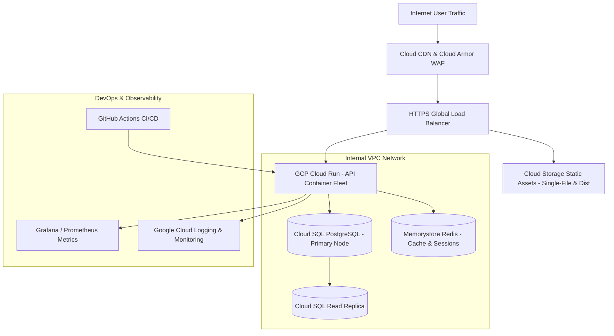

# 05. Cloud Infrastructure & DevOps Architecture

> **Cloud Provider**: Google Cloud Platform (GCP)  
> **Deployment Model**: Serverless Containers (Cloud Run) + Managed Relational DB (Cloud SQL)  
> **Target SLA**: 99.95% Uptime Availability

---

## 1. Cloud Infrastructure Topology Diagram

---

## 2. Infrastructure Component Justification

| GCP Service | Component Role | Justification |
| :--- | :--- | :--- |
| **Cloud Run** | Serverless Microservices Host | Auto-scales stateless API containers from 0 to 100+ instances within seconds based on HTTP concurrency. |
| **Cloud SQL (PostgreSQL)** | Managed Database | Regional HA deployment with automated failover, point-in-time recovery (PITR), and encrypted storage. |
| **Memorystore (Redis)** | In-Memory Caching Layer | Eliminates repetitive database queries for product catalogs and active store feature flag lookup (<2ms latency). |
| **Cloud Armor WAF** | DDoS & Web Security | Protects API endpoints against OWASP Top 10 vulnerabilities, SQL injection, and rate limits brute-force attacks. |
| **Cloud CDN** | Global Asset Distribution | Caches static JavaScript bundles and product catalog images across global edge nodes for sub-20ms asset delivery. |

---

## 3. Disaster Recovery & Backup SLA

- **Recovery Point Objective (RPO)**: **< 5 minutes** (Continuous WAL archive streaming to Cloud Storage).
- **Recovery Time Objective (RTO)**: **< 30 minutes** (Automated Cloud SQL regional failover + Cloud Run container multi-zone deployment).
- **Backup Policy**: Daily automated full backups retained for 30 days, stored with Geo-Redundant storage.
